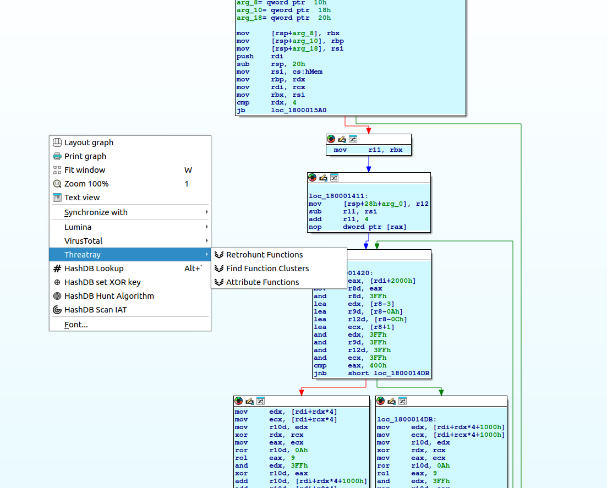
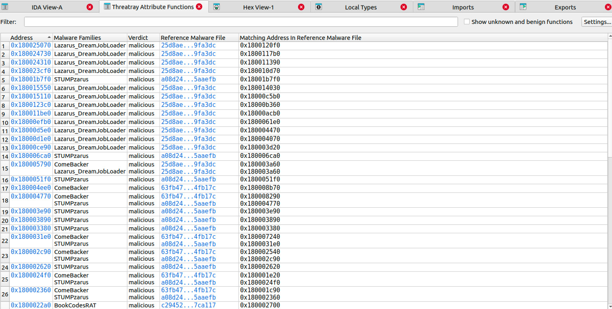
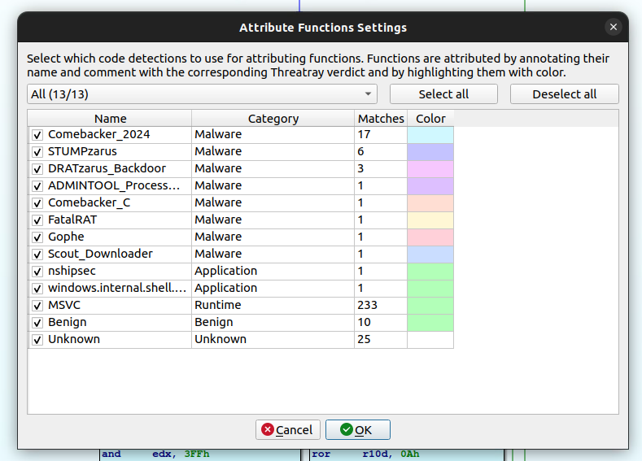
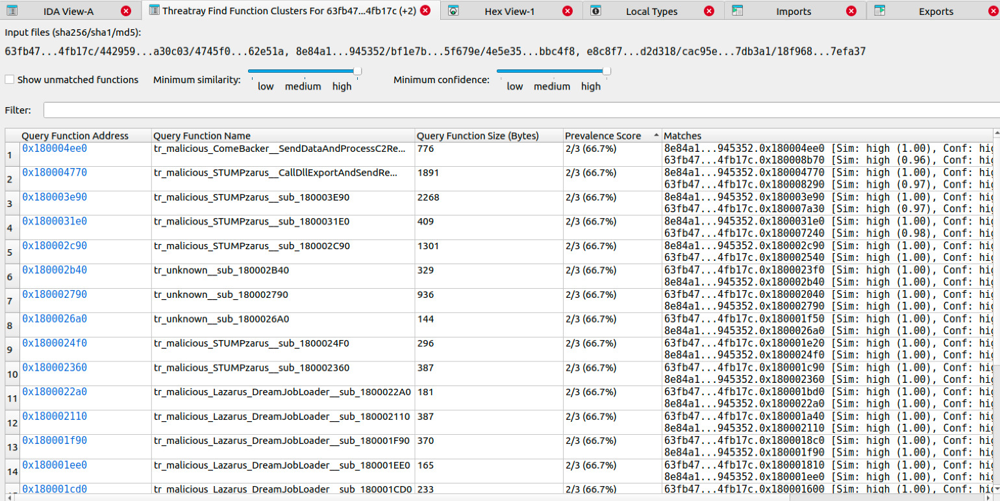
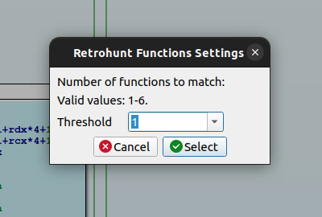
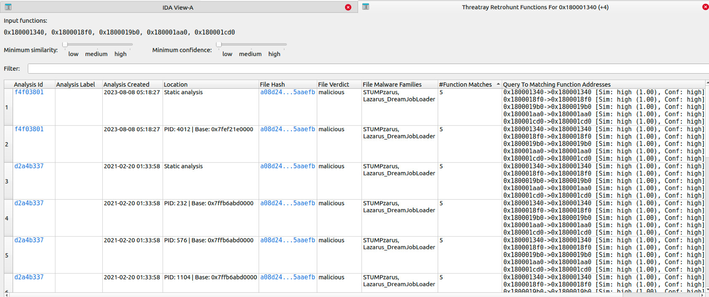

# Threatray IDA Plugin

[](https://github.com/threatray/plugin-ida/actions/workflows/ci.yml)
[](LICENSE)


This plugin integrates Threatray functionalities directly into your IDA Pro environment.

## Features

- **Attribute Functions**: Identify which malware families or libraries functions belong to.
  Functions are annotated with Threatray’s verdict in their name and comment, and highlighted with color.
- **Find Function Clusters**: Discover shared functions across binaries and see how often they occur within the sample set.
- **Retrohunt Functions**: Find malware and goodware samples containing functions similar to your selected function(s).

Make sure the file you’ve opened in IDA has already been analyzed by Threatray.

The plugin supports IDA 8.4+ on Windows, Linux, and macOS, and requires Python 3.10+.

## Installation

1. Install the Python requirements: `python3 -m pip install -r requirements.txt` (see details below regarding Python interpreter).
2. Copy `threatray_plugin.py` and the `threatray_ida` folder into the `plugins` directory of your IDA Pro installation.
3. When starting the plugin for the first time, you will be prompted for the **realm** and **API key**.
   These settings can later be changed via `Edit` > `Plugins` > `Threatray`.
   See https://docs.threatray.com/reference/authentication for more information on authentication and how to obtain the API key.

### Interpreter Details

Make sure you install the requirements with the same Python interpreter that your IDA Pro uses.
You can check this by running `sys.path` in IDA’s Python console.

Examples:
```
>>> C:\Users\developer\AppData\Local\Programs\Python\Python312\python.exe -m pip install -r requirements.txt

$ /usr/bin/python3.11 -m pip install -r requirements.txt

$ /Library/Developer/CommandLineTools/Library/Frameworks/Python3.framework/Versions/3.12/bin/python3.12 -m pip install -r requirements.txt
```

## How to use it

The plugin’s features are available via the Threatray entry in IDA’s right-click context menu.



### General tips

- Result views can be exported:
  - Export everything to CSV via the context menu.
  - Copy selected entries with Ctrl+C or via the context menu.
- Some result entries contain links. These can be copied via the context menu.

### Attribute Functions

The `Attribute Functions` feature identifies which malware families or libraries functions belong to.
It annotates each function’s name, adds a comment, and highlights it with color based on Threatray’s verdict.


*Attribute Functions Settings*



*Attribute Functions Results*

- Double-clicking the `Address` column jumps to the function view (also available via context menu).
- Double-clicking the `Reference Malware File` column opens the analysis of the first hash in Threatray.
- You can launch a `Retrohunt Functions` query from the context menu with one or more selected addresses.

### Find Function Clusters

The `Find Function Clusters` features finds shared functions across binaries and see how often they occur in the
sample set.

It always includes the file currently opened in IDA Pro, plus up to 10 additional files (which must also have been analyzed by Threatray).

By default, benign code is excluded from clustering, but this can be enabled in the settings.

If a function from the current file has multiple matches in another file, a maximum of three matches per file are displayed.



*Find Function Clusters Settings*



*Find Function Clusters Results*

- Double-click a `Query Function Address` to jump to the function view (also available via context menu).
- You can run `Retrohunt Functions` from the context menu with one or more selected addresses.

### Retrohunt Functions

The `Retrohunt Functions` feature finds malware and goodware samples with functions similar to your selected function(s).

Select one or more functions from the functions list view, or right-click a function in the disassembly view to start a retrohunt.

When multiple functions are selected, you can set a threshold value, which specifies how many of the selected functions must match in a file for it to be considered a result.



*Retrohunt Functions Settings*



*Retrohunt Functions Results*

- With multiple query functions, the column `Query To Matching Function Address` lists matches as
  `input function address`->`matching function address in the given file`.
- With a single query function, only the matching address is shown.
- Double-click an `Analysis Id` to open the analysis in Threatray.
- Double-click a `File Hash` to search for this file in Threatray.
- You can run `Find Function Clusters` from the context menu on one or more selected file hashes.
